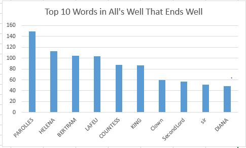

# bigdata-project

### What is Bigdata?

Big data as per [Wikipedia](https://en.wikipedia.org/wiki/Big_data) is a field that treats ways to analyze, systematically extract information from, or otherwise deal with data sets that are too large or complex to be dealt with by traditional data-processing application software.

---

### What are we going to do in this repo?

This repository takes you through a simple Bigdata application that allows us to count the number of words(excluding a few [common words in English](https://en.wikipedia.org/wiki/Most_common_words_in_English)) in a webpage. This repo also helps you to visualize the top 10 words in the form of a chart.

#### Pre-requisites:

1. Spark to be configured - You can check the repo [https://github.com/denisecase/setup-spark](https://github.com/denisecase/setup-spark). This repo has everything you need to setup spark with clear instructions.
2. Ability to run PowerShell as admin. If you would like to set up your system to be run as a professional developer, the repo [https://github.com/denisecase/windows-setup](https://github.com/denisecase/windows-setup) is a great start 
3. IDE (VSCode preferred) download here [https://code.visualstudio.com/](https://code.visualstudio.com/)
4. Basic coding knowledge of Spark. Read [https://spark.apache.org/](https://spark.apache.org/)

---
### Getting started with the word count application.

#### Getting the data for our application.

Here I am using a webpage that is out on the internet for my application and is available at [http://shakespeare.mit.edu/allswell/full.html](http://shakespeare.mit.edu/allswell/full.html).There is no restriction on the website being used.

Now that we found our data, we need to get it to our local-machine to work on it and ```curl``` helps us in grabbing the data from an ```HTML``` page to a text file. Use the command below to do so.

```curl "http://shakespeare.mit.edu/allswell/full.html" -O "allIsWell.txt"```

Now we have our website data on our local machine, but it has the HTML tags in it and needs some cleaning to be done. The ```sed``` command of ```UNIX``` is a powerful command that allows us to remove unwanted data using regex. Run the below command in ```git bash``` to remove most of the HTML tags from our data.

```sed -E 's/<[^>]*>/''/g' allIsWell.txt > allIsWell_cleaned.txt```

Now let's remove most of the common words as well using the same ```sed``` command with words to be removed.

``` sed -E 's/\b(the|The|be|Be|to|To|of|Of|And|and|a|A|in|In|that|That|have|Have|i|I|it|It|for|For|not|Not|on|On|with|With|he|He|as|As|you|You|do|Do|at|At|this|This|his|His|by|By|from|From|they|They|we|We|say|Say|her|Her|she|She|or|Or|an|but|But|will|Will|So|so|my|is|your|me|him|are|what|there|their|one|all|would|up|out|if|about|who|get|which|go)\b/''/g' allIsWell_cleaned.txt > allIsWell_final.txt```

You can do further cleaning if needed. 

---

#### Working with spark 

Open Powershell as Administrator in the repo folder and run the command ```spark-shell```. This will bring up spark with scala.

Create a Resilient Distributed Dataset (RDD) to start working with. Before we start working with RDD, a brief description of RDD's are available here [https://spark.apache.org/docs/latest/rdd-programming-guide.html](https://spark.apache.org/docs/latest/rdd-programming-guide.html)

##### Steps:
1. Text file RDDs can be created using SparkContext’s textFile method. 

    ```val aiwRdd = sc.textFile("allIsWell_final.txt")``` 

    This command creates an RDD from the cleaned file for us to start working.

2. Split the data based on spaces and save it into a new dataset using the ```flatMap``` method. Use the command to do so
    ```val splitedData = aiwRdd.flatMap(line => line.split(" "));```

    This command creates an array of words which can be seen by using the ```collect()``` method of RDD.

3. Now that we have our words split, we need to count them. So the ``` map()``` method helps us in creating key-value pairs. Let's just start by assigning each key(word) a value of 1. This is called mapping of data.

    ```val mappedData = splitedData.map(word =>(word,1));```

    Now the ```collect()``` method returns, key-value pairs of words with a count of 1. Now, let's add them up which is reducing in Bigdata terms.

4. Use the command to reduce the key-value pairs to be unique. 

    ```val reducedData = mappedData.reduceByKey(_+_);```

    Now the ```collect()``` method returns the counts of individual words. Now let's sort the data to find the word that was most used.

5. The ```sortBy()``` method helps us in doing so

    ``` val sortedData = reducedData.sortBy(_._2, false)```

    The ```collect()``` method now returns the data in descending order of counts. You can just get the top 10 elements using the ```take()``` method. ```sortedData.take(10)```

---

#### Getting the RDD for visualization

The data is now in the RDD and we cannot visualize it so we have to bring it to our local machine and to make it happen, RDD has a method ```saveAsTextFile()```. Use the below command to bring the RDD to our local machine.

```sortedData.saveAsTextFile("output")```

---

### Visualising the data

The output folder contains a part-00000 file which has the key-value pairs in it. copy the data to an excel and split the data using the delimiter. Create a chart by selecting the words you want, I selected the top 10 words , and the chart is shown below.



---

### References:

- Setting up windows for professional development - [https://github.com/denisecase/windows-setup](https://github.com/denisecase/windows-setup)
- Setting up spark on windows - [https://github.com/denisecase/setup-spark](https://github.com/denisecase/setup-spark)

- Data for the project obtained at - [http://shakespeare.mit.edu/allswell/full.html](http://shakespeare.mit.edu/allswell/full.html)

- Guide for RDD programming - [https://spark.apache.org/docs/latest/rdd-programming-guide.html](https://spark.apache.org/docs/latest/rdd-programming-guide.html)

- Test your regex - [https://www.regextester.com/](https://www.regextester.com/)

- Common words in English [https://en.wikipedia.org/wiki/Most_common_words_in_English](https://en.wikipedia.org/wiki/Most_common_words_in_English)

- Wikipedia [https://en.wikipedia.org/wiki/Main_Page](https://en.wikipedia.org/wiki/Main_Page)

---